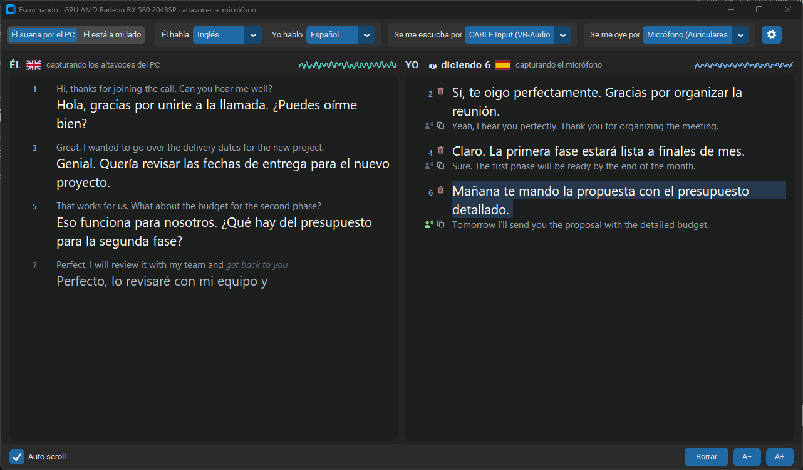
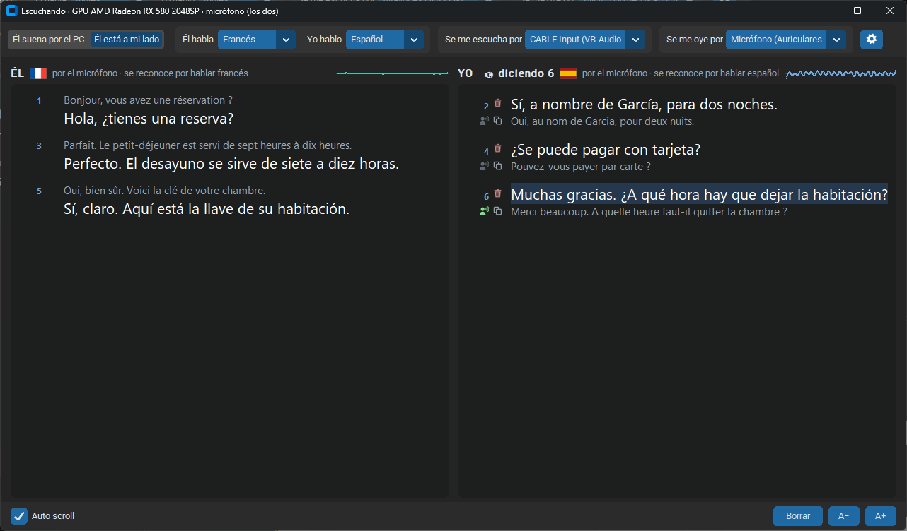
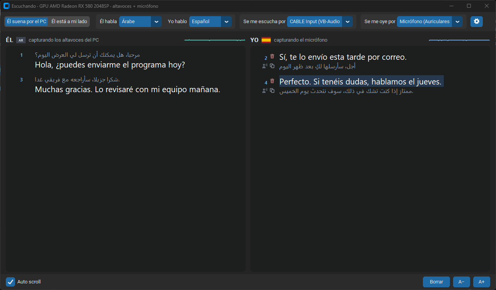
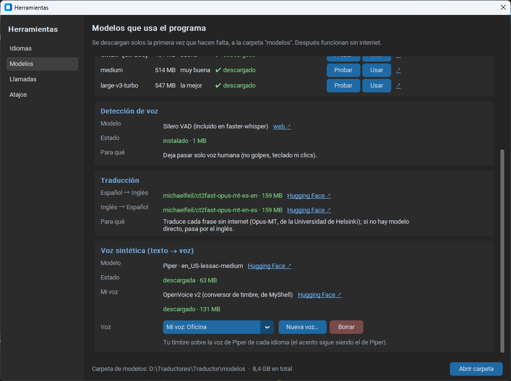
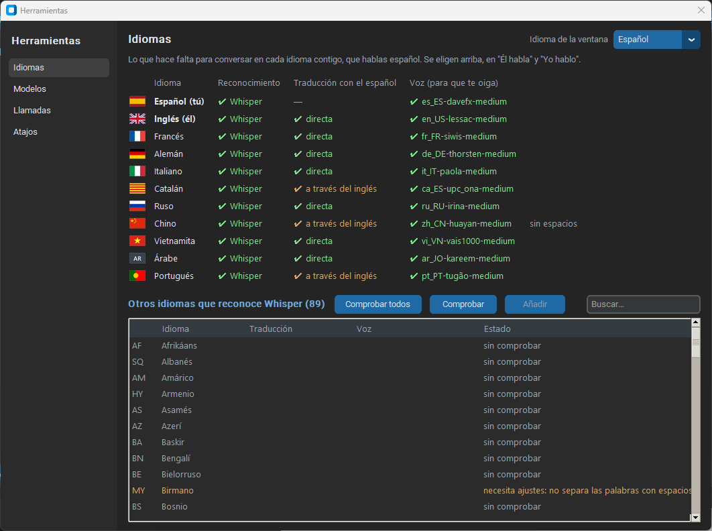

# offline call interpreter

**Intérprete de voz en tiempo real para Windows, en los dos sentidos y 100 % sin internet.**
Hablas en tu idioma, el otro te oye en el suyo, y lo que él dice lo lees traducido. Funciona en llamadas de **Teams, Zoom o WhatsApp Web** y en conversaciones cara a cara.



## Qué lo diferencia

- **Nada sale de tu PC.** Reconocimiento, traducción y voz se ejecutan en local: sin cuentas, sin suscripción y sin enviar tus conversaciones a la nube.
- **Sirve con cualquier aplicación de llamadas**, no solo con una: tu voz traducida entra en la llamada como si fuera un micrófono.
- **Tú decides qué se dice.** Ves tu frase transcrita y traducida, la corriges con el teclado si hace falta y suena al pulsar su icono.
- **Con tu propia voz.** Opcional: grabas 30 segundos y el otro te oye con tu timbre en su idioma.
- **Va en tarjetas gráficas antiguas**, también AMD e Intel (Vulkan), no solo en NVIDIA. Sin tarjeta compatible, funciona con el procesador.

## Funciones

- 11 idiomas listos (español, inglés, francés, alemán, italiano, catalán, portugués, ruso, chino, vietnamita y árabe) y se pueden añadir más desde el programa.
- Modo **llamada** (el otro suena por el PC) y modo **en persona** (los dos por el mismo micrófono).
- Corrección de cada frase en el sitio, también mientras hablas, y atajos de teclado para no soltarlo.
- Elección del modelo de reconocimiento, con prueba de velocidad en tu equipo.
- Interfaz en español, inglés o cualquier idioma del catálogo.

## Instalación

1. Descarga el repositorio (**Code → Download ZIP**) y descomprímelo donde lo vayas a usar.
2. Ejecuta **`1_instalar.bat`**. Prepara Python y sus paquetes (si falta Python, ofrece instalarlo).
3. Abre **`2_conversacion.bat`**. La primera vez descarga los modelos que necesita (~500 MB para español ↔ inglés).

Para que el otro te oiga en una llamada, instala [VB-Audio Virtual Cable](https://vb-audio.com/Cable/) (gratis). Los pasos para Teams, Zoom y WhatsApp Web están dentro del programa, en **Herramientas → Llamadas**.

**Requisitos:** Windows 10/11, Python 3.11 o posterior, e internet solo la primera vez que se usa cada modelo.

## Cómo funciona

```
Audio (altavoces / micrófono) → Silero VAD → Whisper → Opus-MT → Piper (+ OpenVoice para tu voz)
```

Todo son modelos abiertos que se descargan de Hugging Face y después funcionan sin conexión. El detalle de cada pantalla, los modelos y las GPU admitidas está en el [manual](docs/MANUAL.md).

## Más capturas

| En persona (español ↔ francés) | Árabe |
|---|---|
|  |  |
| **Mi voz** | **Idiomas** |
|  |  |

## Licencia

MIT (ver [LICENSE](LICENSE)). Los componentes de terceros conservan la suya: ver [TERCEROS.md](TERCEROS.md).
