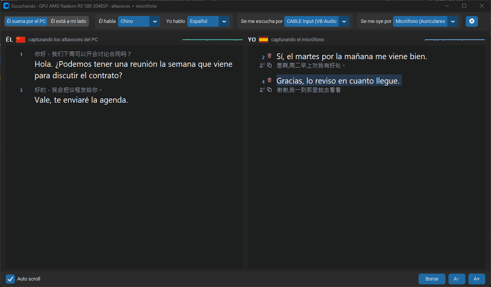
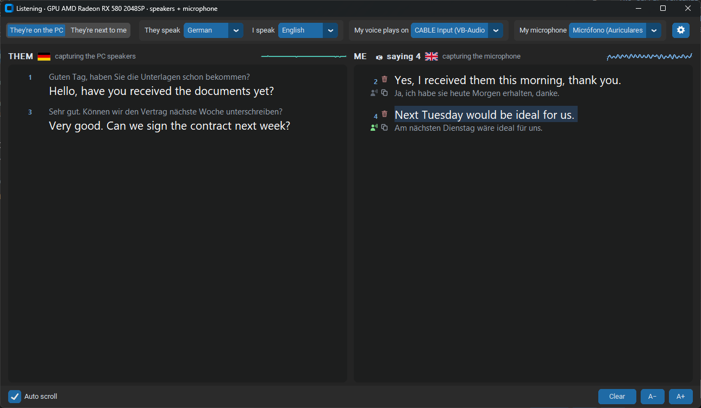
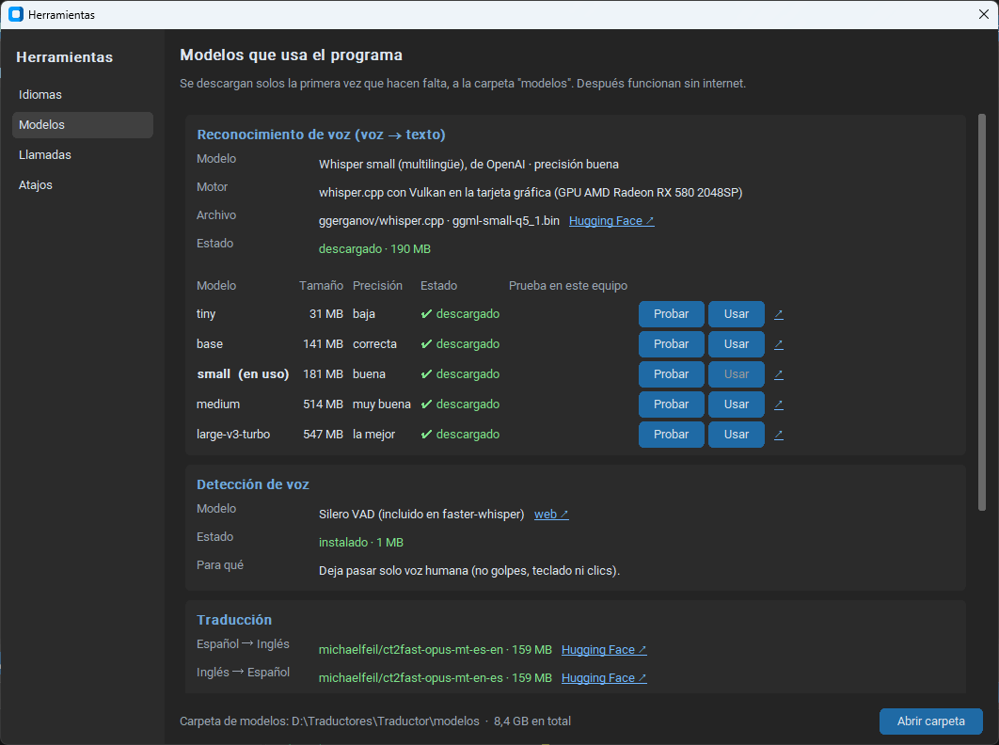
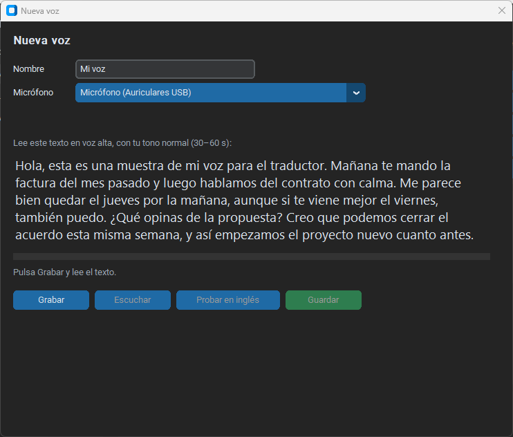
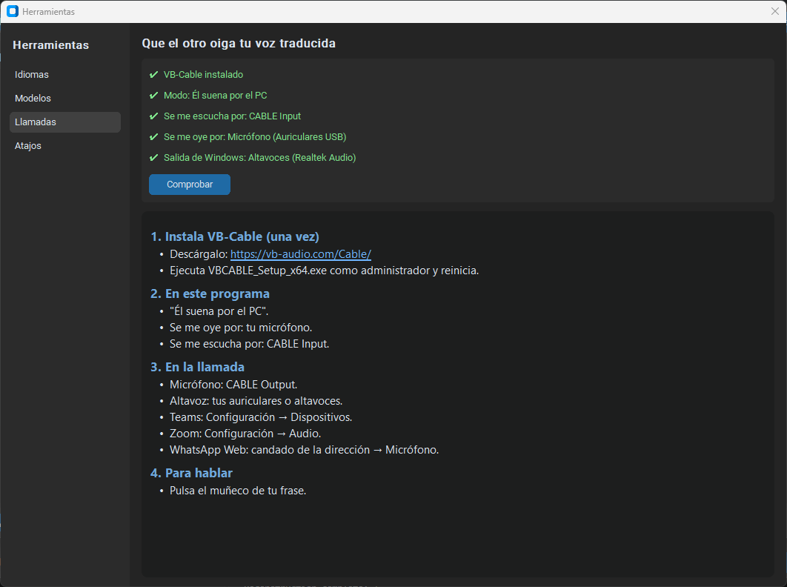
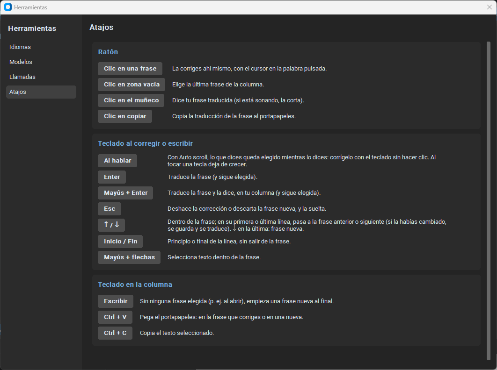

# Manual: conversación traducida en directo para Windows

Traductor de voz en tiempo real para **Windows 10/11** que funciona **sin conexión**, para conversar en los dos sentidos. Sirve en una llamada (Teams, Zoom…) o en persona:

- Lo que dice la otra persona se transcribe y **lo lees traducido** a tu idioma.
- Lo que dices tú se transcribe y se traduce, y **se dice en voz alta en su idioma** con una voz sintética cuando pulsas el icono de esa frase.

Idiomas: **español, inglés, francés, alemán, italiano, catalán, portugués, ruso, chino, vietnamita y árabe**, en cualquier combinación (los pares sin traductor directo pasan por el inglés). Internet solo hace falta para descargar los modelos la primera vez que se usa cada uno.

Toda la cadena se ejecuta en local:

```
WASAPI (loopback / micrófono) → Silero VAD → Whisper → Opus-MT → Piper TTS
```

- **Reconocimiento:** whisper.cpp acelerado por GPU con Vulkan, o faster-whisper sobre CTranslate2 en la CPU. Transcripción incremental re-decodificando la frase en curso cada ~0,4 s.
- **Traducción:** modelos Marian (Opus-MT) cuantizados a int8 con CTranslate2.
- **Voz:** modelos VITS de Piper ejecutados con ONNX Runtime.
- **Llamadas:** cancelación de eco propia (alineación por cuenta de muestras + filtro FIR adaptativo) para poder capturar los altavoces mientras suena la voz traducida.

## Capturas

**En una llamada** (Teams, Zoom…): a la izquierda lo que dice el otro, traducido; a la derecha lo que dices tú y su traducción, que se dice en su idioma al pulsar el muñeco.


**En persona** ("Él está a mi lado"): los dos por el mismo micrófono; se distingue quién habla por el idioma.


| Árabe (de derecha a izquierda) | Chino |
|---|---|
|  |  |

| Interfaz en inglés | Herramientas → Idiomas |
|---|---|
|  |  |

| Herramientas → Modelos | Mi voz (tu timbre en su idioma) |
|---|---|
|  |  |

| Grabar una voz nueva | Ayuda para llamadas | Atajos |
|---|---|---|
|  |  |  |

## Instalación

1. Descarga el repositorio (**Code → Download ZIP** y descomprímelo, o clónalo) en la carpeta donde vayas a usarlo. Hazlo **antes** de instalar, porque el entorno de Python que se crea solo funciona en el sitio donde se instaló.
2. Ejecuta `1_instalar.bat`. Crea un entorno de Python (`venv`) y descarga los paquetes, sin ningún modelo. Si falta Python, ofrece instalarlo con `winget`.
3. Abre `2_conversacion.bat`. La primera vez descarga a `modelos\` solo lo que necesita:
   - Español ↔ inglés: unos 500 MB (Whisper, los dos traductores y la voz).
   - Cada idioma nuevo: unos 200 MB (sus traductores y su voz), la primera vez que se elige.

## Uso

```bat
2_conversacion.bat                                 :: últimos idiomas elegidos
2_conversacion.bat --yo es --el fr                 :: yo hablo español, él francés
2_conversacion.bat --yo de --el it --modo presencial
```

Los idiomas también se eligen en la ventana, arriba ("Él habla" / "Yo hablo"), junto con tu micrófono ("Se me oye por") y la salida de tu voz traducida ("Se me escucha por"). El estado (cargando, motor en uso, avisos) se muestra en el título de la ventana. La columna **ÉL** muestra lo que dice la otra persona, traducido. La columna **YO** muestra lo que dices tú y, debajo, su traducción.

### Decir tu frase traducida

Tu voz traducida **no suena sola**. Debajo del número de cada frase tuya hay un **muñeco hablando**: al pulsarlo se dice su traducción por "Se me escucha por" (en Teams, el cable). Así revisas o corriges la frase antes de que la oiga el otro, y puedes repetir cualquiera cuando quieras.

Con el interruptor **Hablar automáticamente** (abajo, a la izquierda de Borrar) encendido, cada frase que dices se dice traducida en cuanto la terminas, sin pulsar el muñeco; si la corriges mientras la dices, suena ya corregida. Las frases que escribes a mano no se dicen solas (Mayús+Enter o el muñeco).

Al lado del muñeco está el icono de **copiar** (dos hojas): copia la traducción de esa frase al portapapeles para pegarla donde quieras (se pone verde un momento al copiar).

Si pulsas varios muñecos seguidos, se dicen uno detrás de otro. El color del muñeco indica en qué punto está cada frase:

| Color | Estado |
|---|---|
| Azul | No dicha (aún no ha sonado, o se ha corregido después) |
| Ámbar | En cola, esperando su turno |
| Verde | Sonando ahora (pulsarlo la corta y pasa a gris; si hay otra en cola, empieza) |
| Gris | Ya dicha (se puede pulsar otra vez para repetirla) |

### La onda de cada columna

Junto a ÉL y a YO hay un pequeño gráfico con la onda de los últimos 2 segundos de lo que se captura (azul verdoso: lo que suena por el PC; azul: tu micrófono). Si está plana mientras alguien habla, ese audio no llega al programa (o está silenciado).

### Auto scroll

La casilla **Auto scroll** (abajo, bajo la columna ÉL) hace que las dos columnas bajen solas a lo último que se dice en cuanto alguien empieza a hablar, aunque hayas subido para leer algo anterior. Desmarcada, la columna se queda donde la dejes. Mientras corriges una frase (hasta 4 s después de tu último clic o tecla en ella), su columna no se mueve; si dejas la corrección abierta sin tocarla, la columna vuelve a seguir la conversación, y al escribir en la corrección vuelve a mostrarla.

Con Auto scroll, **lo que dices queda elegido mientras lo dices**, con el cursor al final y creciendo con cada palabra: si ves una palabra mal, la corriges con el teclado (←, Ctrl+←, Retroceso…) sin hacer clic. Al tocar una tecla la frase deja de crecer (lo que digas después se suma detrás) y se corrige como cualquier otra. Al terminar de hablar sigue elegida (Mayús+Enter la dice). Una frase elegida a mano (clic, ↑/↓) se suelta para elegir lo que dices si llevas 4 s sin tocarla y no tiene cambios; si la estás corrigiendo o tiene cambios sin guardar, se respeta.

### Corregir una frase

Funciona en las dos columnas: en lo que dices tú (YO) y en lo que dice él (ÉL). Si el reconocimiento se equivoca (por ejemplo, "fatura" en lugar de "factura"), haz **clic** justo sobre la palabra que está mal (el cursor se convierte en una mano). La frase se resalta y el cursor de escritura queda en esa palabra, sin que cambie cómo se ve el texto. Corrígela allí mismo y pulsa **Enter**:

- Se vuelve a traducir.
- Para que se diga, pulsa después su muñeco, o termina con **Mayúsculas+Enter**: traduce y la dice de una vez.
- La corrección se anota en el registro de la conversación, marcada como "(corregida)".
- **Esc** deshace la corrección, y un clic fuera de la frase también.
- **↑ / ↓** en la primera o última línea de la frase pasan a la frase anterior o siguiente (si la habías cambiado, se guarda y se traduce, como con Enter). Así se recorre la conversación con el teclado y, con **Mayúsculas+Enter**, se dice la frase en la que estás. Enter y Mayúsculas+Enter dejan la frase elegida; Esc la suelta.
- **Un clic en el panel** sin dar en ninguna frase elige la última; un clic en cualquier parte de una frase (su número, sus iconos o su traducción) elige esa frase.

**También mientras hablas.** En la frase que aún estás diciendo (con el número en gris), lo que ya sale en **blanco** está confirmado y se puede corregir igual, sin esperar a que termines. Las palabras nuevas que vayan llegando aparecen detrás, sin mover lo que estás corrigiendo. Al terminar la frase, se traduce entera con tu corrección y aparece su muñeco; con Mayúsculas+Enter, además se dice en ese momento. Lo que sale en **gris y cursiva** es provisional (aún puede cambiar) y no se corrige.

### Añadir una frase escrita

Sin ninguna frase elegida (al abrir el programa, o tras **Esc**), **escribe** o pega con **Ctrl+V**: se crea una frase nueva al final de la columna con lo que escribes o pegas. También con **↓** en la última frase. **Esc**, o dejarla vacía, la descarta.

- **YO**: escríbela en tu idioma y pulsa **Enter**: se traduce y se anota en el registro como las que dices. Para que se diga, pulsa su muñeco o usa **Mayúsculas+Enter** en lugar de Enter.
- **ÉL**: para anotar algo que dijo y no se captó. Escríbelo en su idioma y pulsa **Enter**: se traduce al tuyo y se anota en el registro como frase suya. No se dice en voz alta.

### Modos

- **"Él suena por el PC"** (llamada): su voz se captura de los altavoces del ordenador y la tuya del micrófono.
- **"Él está a mi lado"** (presencial): los dos habláis al mismo micrófono y se distingue quién habla por el idioma, así que los dos idiomas tienen que ser distintos. Mientras suena tu voz traducida por los altavoces, el micrófono se silencia.

### Llamadas con Teams, Zoom, WhatsApp… (para que el otro oiga tu voz traducida)

El botón de **herramientas** (engranaje, al final de la barra de arriba) abre una ventana con un índice de capítulos a la izquierda (Modelos, Llamadas y Atajos):

- **Llamadas**: estos pasos y una **comprobación de tu configuración** (si VB-Cable está instalado y elegido, si el micrófono y la salida de Windows son los correctos).
- **Atajos**: lo que hace cada clic (corregir, frase nueva, muñeco, copiar) y cada tecla (Enter, Mayús+Enter, Esc, Inicio/Fin, Ctrl+V…).
- **Modelos**: qué modelos de IA usa ahora el programa (reconocimiento de voz y motor en uso, detección de voz, traductores de tus idiomas y voz sintética), si están descargados, cuánto ocupan, un enlace **Hugging Face ↗** a la página de cada modelo y un botón para abrir la carpeta `modelos`.
  - **Mi voz** (tarjeta "Voz sintética", desplegable **Voz**): tu traducción puede sonar con **tu timbre**. Piper dice la frase en el idioma del otro (con su acento) y el conversor de timbre **OpenVoice v2** (MyShell, MIT) la pasa a tu voz. **Nueva voz…** abre un asistente: eliges micrófono, lees un texto (30–60 s), la escuchas, la pruebas en el idioma del otro y la guardas con un nombre; puedes tener varias y elegir cuál usar (o la de Piper). Necesita **PyTorch**, que no va en la instalación: el asistente lo instala la primera vez (~200 MB de descarga, ~1 GB instalado), y el modelo del conversor (~130 MB) se descarga a `modelos\`. En un procesador normal convertir una frase tarda ~2 s, pero se hace en cuanto se traduce: al pulsar el muñeco suena al momento. Mientras el asistente está abierto la conversación se pausa. Tus voces se guardan en `voces\` (no se copian a la versión portable).
- **Idiomas**: cada idioma del catálogo con lo que tiene: reconocimiento, traducción con tu idioma (directa o a través del inglés) y voz. Los idiomas sin espacios (chino) se transcriben carácter a carácter.
  - **Idioma de la ventana** (arriba a la derecha): español, inglés (revisado a mano) o cualquier idioma del catálogo. La primera vez que se elige uno, sus textos se traducen con el propio traductor del programa a partir del inglés (unos segundos) y quedan en `interfaz\<código>.json`, donde se pueden corregir. La ventana se cierra y se vuelve a abrir en ese idioma.
  - Debajo, **los demás idiomas que reconoce Whisper** (91). Elige uno o varios y pulsa **Comprobar** (o **Comprobar todos**): busca en Hugging Face si tienen traductor con el inglés en los dos sentidos y voz. Si Hugging Face limita las consultas (sin cuenta pasa a menudo), espera y reintenta solo.
  - **Añadir** (cuando se puede): descarga sus modelos, los prueba (traduce una frase de ida y vuelta y genera la voz) y lo añade a los desplegables. Se guarda en `idiomas.json`. Los idiomas añadidos así se pueden **Quitar** (sus modelos se quedan en `modelos`).
  - Los que se escriben de derecha a izquierda (salvo el árabe), los que no usan espacios (salvo el chino) y el japonés y el coreano salen como "necesita ajustes" y no se pueden añadir sin más.
  - **Elegir el modelo de reconocimiento de voz**: tiny, base, small, medium o large-v3-turbo (en la tarjeta gráfica se usan sus versiones comprimidas, más ligeras). **Probar** transcribe una frase de prueba (dicha por la voz sintética en tu idioma) y muestra qué ha entendido y cada cuánto se actualizaría el texto mientras hablas en este equipo (fluido / algo más lento / lento). **Usar** lo descarga si hace falta y lo pone en marcha sin cerrar el programa. Cuanto más grande, mejor entiende, pero más tarda. Funciona con cualquier programa de llamadas que se use en el PC (también en el navegador); con WhatsApp en el móvil no, porque el audio no pasa por el PC.

Teams solo envía lo que entra por el micrófono que tiene elegido. Para que tu voz traducida le llegue al interlocutor, necesitas un micrófono virtual:

1. Instala **[VB-Audio Virtual Cable](https://vb-audio.com/Cable/)** (gratis): ejecuta `VBCABLE_Setup_x64.exe` como administrador y reinicia.
2. En el traductor, en **"Se me escucha por"** (por dónde sale tu voz traducida), elige **CABLE Input (VB-Audio Virtual Cable)**.
3. En Teams, ve a Configuración → Dispositivos → **Micrófono** y elige **CABLE Output (VB-Audio Virtual Cable)**.

```
tu voz ─► tu micrófono ─► traductor ─► voz traducida ─► CABLE Input
                                                            │
interlocutor ◄── Teams ◄── micrófono de Teams = CABLE Output ◄──┘
```

Al instalarse, VB-Cable puede ponerse como **salida de sonido predeterminada de Windows**. Si pasa, no oirás al otro, porque Teams le mandaría su voz al cable. Vuelve a poner tus altavoces o auriculares en Configuración de sonido → Salida, y revisa que en Teams el **altavoz** sean ellos. El programa nunca captura el cable, así que tu voz traducida no vuelve a aparecer como si la dijera él, y si la salida de Windows es el cable, lo avisa en el título de la ventana.

Así el interlocutor oye solo tu voz traducida, no tu voz real. Si quieres que oiga las dos, hay que mezclarlas con Voicemeeter, también de VB-Audio. Si la voz le llega entrecortada, baja la supresión de ruido de Teams a "Baja" o "Desactivada".

### Ajustes

- **Se me oye por:** tu micrófono. En "Él suena por el PC" queda siempre libre, así que podéis hablar a la vez. Si el programa detecta que el micrófono oye los altavoces (sin auriculares o con mucho volumen), lo silencia solo mientras suenan y lo avisa en naranja junto a YO. Además, descarta lo que entre por tu micrófono en el idioma del otro.
- **Eco (automático):** si tu voz traducida sale por los mismos altavoces que se capturan, se resta de la captura para seguir oyéndole a él aunque habléis a la vez. Junto a ÉL se ve su estado ("eco: esperando a medir", "eco: comprobado (… dB)"). Si no puede restarla con seguridad, silencia ese trozo. Con VB-Cable no actúa, porque tu voz no pasa por tus altavoces.
- Los ajustes se guardan en `conversacion.json` y cada conversación en `transcripciones\conversacion_FECHA.txt`, con el texto original y la traducción.

## Cómo funciona

1. **Captura de audio.**
   - Su voz, en una llamada, se toma directamente de la salida de audio de Windows (*loopback* WASAPI). Es una copia digital exacta, sin pasar por el aire.
   - Tu voz se toma del micrófono.
2. **Filtros antes de reconocer.**
   - Un detector de voz (Silero VAD) deja pasar solo voz humana: descarta golpes, teclado y clics.
   - El **cancelador de eco** resta tu voz traducida de la captura de altavoces. Sabe exactamente qué audio reproduce y dónde cae, porque cuenta las muestras de salida y de entrada. Un filtro FIR adaptativo de 32 coeficientes lo ajusta a lo que Windows altera la señal. Si no puede restarla con seguridad, silencia ese trozo, para no confundir nunca tu voz con la suya.
   - Un **detector de fugas** compara el micrófono con lo que suena por los altavoces, por correlación cruzada en la banda de 200 Hz a 4 kHz, para detectar cuándo el micrófono los oye.
3. **Reconocimiento de voz (Whisper) palabra a palabra.**
   - Whisper no trabaja en *streaming*, así que cada ~0,4 s se vuelve a transcribir el audio acumulado de la frase en curso.
   - Las palabras que coinciden en dos pasadas seguidas se dan por definitivas y se muestran en blanco. El resto se muestra en gris, como provisional.
   - Cada frase se cierra en una pausa o al acabar una frase larga.
4. **Detección de idioma.**
   - Whisper estima el idioma tras ~2 s de voz y lo vuelve a comprobar cada ~3 s.
   - En el modo presencial, el idioma decide quién habla.
   - Una comprobación con palabras frecuentes descarta lo que se cuela por tu micrófono en el idioma del otro.
5. **Traducción.**
   - Se usan modelos Opus-MT, frase a frase y con caché, para no volver a traducir lo ya traducido mientras la frase crece.
   - Si no hay modelo directo para un par (francés → italiano), se pasa por el inglés.
   - Si un modelo no se puede cargar, se recurre a Google Translate, que sí necesita internet.
6. **Voz sintética (Piper).** Tu frase traducida se sintetiza con la voz del idioma del otro y sale por el dispositivo elegido: los altavoces o el cable virtual.

### Motores de reconocimiento

| Motor | Cuándo se usa | Hardware |
|---|---|---|
| **whisper.cpp + Vulkan** (`motor_gpu\whisper-server.exe`) | Siempre que haya tarjeta gráfica compatible | GPU AMD, NVIDIA o Intel. Gasta unas 10 veces menos CPU. Se arranca en segundo plano y recibe el audio por HTTP local. |
| **faster-whisper** (CTranslate2) | Si la GPU no se puede usar | CPU (int8), o GPU NVIDIA con CUDA |

### GPU admitidas

El motor GPU (whisper.cpp con backend `ggml-vulkan`) funciona con cualquier tarjeta que tenga **controlador Vulkan 1.2 o superior**. No hay que instalar nada aparte del controlador normal de la tarjeta: `motor_gpu\` ya incluye todo lo demás, junto con el runtime de Visual C++.

| Fabricante | Tarjetas | Notas |
|---|---|---|
| **AMD** | Radeon RX 400 y posteriores (RX 500, 5000, 6000, 7000…), Radeon Vega y gráficas integradas Ryzen | Probado en RX 580 |
| **NVIDIA** | GeForce GTX 900 y posteriores, RTX 20/30/40/50 | También sirve el motor CUDA |
| **Intel** | Iris Xe, Arc y gráficas integradas desde la 6.ª generación (HD/UHD Graphics) | |

- El modelo `base` necesita unos **300 MB de VRAM**. Si la GPU no se puede usar, el programa pasa automáticamente a la CPU. El motivo queda en `motor_gpu\servidor.log`.
- **CUDA (solo NVIDIA)** lo usa faster-whisper cuando falla Vulkan. Requiere CUDA 12 con las librerías cuBLAS y cuDNN instaladas; si no están, usa la CPU.
- **Sin GPU compatible** funciona con la CPU (int8), con más consumo de CPU y algo más de retraso.

## Modelos de IA

Todos son modelos abiertos que se descargan de Hugging Face la primera vez que hacen falta y se guardan en `modelos\`. Solo se descargan los de los idiomas que se usan.

| Tarea | Modelo | Tamaño |
|---|---|---|
| Voz → texto | **Whisper base** multilingüe: `ggerganov/whisper.cpp` (`ggml-base.bin`) para la GPU; `Systran/faster-whisper-base` solo si se usa la CPU | ~140 MB |
| Detección de voz | **Silero VAD** (incluido en el paquete faster-whisper) | <2 MB |
| Traducción | **Opus-MT** (Helsinki-NLP, University of Helsinki), convertido a CTranslate2: `michaelfeil/ct2fast-opus-mt-*` (es↔en) y `ooeoeo/opus-mt-*-ct2-float16` (resto de pares) | ~150 MB por par y sentido |
| Texto → voz | **Piper** (`rhasspy/piper-voices`): `es_ES-davefx`, `en_US-lessac`, `fr_FR-siwis`, `de_DE-thorsten`, `it_IT-paola`, `ca_ES-upc_ona`, `ru_RU-irina`, `zh_CN-huayan`, `vi_VN-vais1000`, `ar_JO-kareem`, `pt_PT-tugão` (calidad *medium*) | ~60 MB por voz |

Pares de traducción con modelo directo: todos los de es, en, fr, de e it entre sí (salvo francés → italiano); ruso y vietnamita con el inglés y el español; catalán con el inglés y catalán → español; chino con el inglés; árabe con el inglés y el español; portugués (de Portugal) con el inglés (`opus-mt-tc-big-en-pt` y `opus-mt-ROMANCE-en`). El resto se traduce pasando por el inglés (en Herramientas → Idiomas se ve cuál es cuál).

**Árabe:** se traduce y se habla en **árabe estándar moderno** (el que entiende cualquier país árabe; la voz tiene acento jordano). Whisper reconoce bien el estándar y peor los dialectos fuertes (egipcio, marroquí...); con árabe conviene el modelo `small` o mayor. Las frases en árabe se alinean a la derecha; al corregirlas, el cursor puede no caer justo en la letra pulsada.

## Stack técnico

| Capa | Tecnología |
|---|---|
| Lenguaje | Python 3.12+ en un entorno virtual (`venv`) |
| Interfaz | CustomTkinter (Tkinter con tema oscuro) |
| Captura y reproducción de audio | PyAudioWPatch (PortAudio con WASAPI y *loopback* de Windows) |
| Procesado de señal | NumPy y SciPy: remuestreo a 16 kHz, correlación por FFT, filtros paso banda y FIR adaptativo |
| Reconocimiento de voz | whisper.cpp compilado con Vulkan (`ggml-vulkan.dll`) y faster-whisper (CTranslate2) |
| Traducción | CTranslate2 (int8 en CPU) + SentencePiece; deep-translator como respaldo en línea |
| Síntesis de voz | piper-tts sobre ONNX Runtime |
| Modelos | huggingface_hub (descarga y caché local en `modelos\`) |

### Archivos

| Archivo | Contenido |
|---|---|
| `1_instalar.bat` | Crea el entorno de Python e instala los paquetes |
| `2_conversacion.bat` | Abre la conversación (acepta `--yo`, `--el`, `--modo`) |
| `conversacion.py` | Ventana, canales YO/ÉL, filtros y detector de fugas |
| `interfaz.py`, `interfaz\` | Idioma de la ventana: textos en otros idiomas y su generación |
| `mivoz.py`, `openvoice_lite\` | "Mi voz": grabaciones, huellas de voz y conversor de timbre (OpenVoice v2, MIT) |
| `transcriptor.py` | Transcripción palabra a palabra y detección de idioma |
| `motores.py` | Motores de reconocimiento: whisper.cpp (Vulkan) y faster-whisper (CPU/CUDA) |
| `traductor.py` | Captura de audio, carga de Whisper y traductor Opus-MT |
| `voz.py` | Síntesis y reproducción de voz con Piper |
| `eco.py` | Cancelador de eco de la voz traducida |
| `motor_gpu\` | whisper.cpp con Vulkan (`whisper-server.exe` y librerías) |
| `requirements.txt` | Paquetes de Python que instala `1_instalar.bat` |

## Requisitos

- Windows 10 u 11.
- Python 3.11 o posterior (`1_instalar.bat` puede instalarlo).
- Para el motor GPU: una tarjeta con Vulkan 1.2 (ver [GPU admitidas](#gpu-admitidas)) y su controlador. Sin GPU compatible funciona igual con la CPU.
- Internet la primera vez que se usa cada modelo.
- Para llamadas en las que el otro oiga tu voz traducida: [VB-Audio Virtual Cable](https://vb-audio.com/Cable/) (gratis).

## Licencia

El código de este programa se publica con licencia **MIT** (ver [LICENSE](../LICENSE)). Lo que incluye o descarga de otros tiene su propia licencia: ver [TERCEROS.md](../TERCEROS.md).
